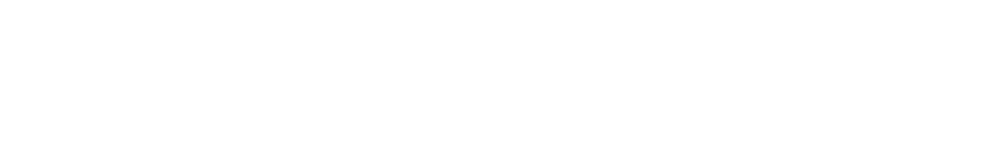

# **Genesis** 
Ce projet a pour but de créer une interface utilisateur (UI) pour tester la puissance de **Genesis**, une plateforme de simulation physique dédiée à la robotique, à l'IA embarque (Embodied AI) et à l'IA physique (Physical AI).

---

## 💡 **Genesis, c'est quoi ?**

Genesis est une plateforme de simulation innovante qui combine plusieurs technologies de pointe :

- **Un moteur physique universel** : Capable de simuler une large gamme de matériaux et de phénomènes physiques avec une précision inégalée.
- **Une plateforme de simulation robotique** : Léger, rapide et facile à utiliser, idéal pour la recherche et le développement.
- **Un système de rendu photo-réaliste** : Pour des simulations visuellement immersives.
- **Un moteur de données génératif** : Transforme des descriptions en langage naturel en données multimodales (vidéos, environnements 3D, etc.).

Genesis est conçu pour **abaisser les barrières** de la simulation physique et rendre la recherche en robotique accessible à tous.

 

---

# **Objectif du projet**

L'objectif de ce projet est de créer une **interface utilisateur intuitive** permettant aux utilisateurs de :

1. **Saisir un prompt** : Une description textuelle de la simulation souhaitée (ex : "Un robot qui marche sur un terrain accidenté").
2. **Générer une simulation** : Envoyer le prompt à Genesis pour créer une vidéo de simulation.
3. **Afficher le résultat** : Récupérer et afficher la vidéo générée directement dans l'interface.

---

## **Fonctionnalités**

- **Saisie de prompt** : Les utilisateurs peuvent décrire la simulation qu'ils souhaitent voir.
- **Génération de vidéos** : Appel de l'API Genesis pour créer des simulations basées sur le prompt.
- **Stockage des vidéos** : Les vidéos générées sont sauvegardées sur **Cloudinary** pour un accès facile.
- **Affichage des résultats** : Les utilisateurs peuvent visualiser les vidéos directement dans l'interface.

---

## **Technologies utilisées**

- **Frontend** : React (pour l'interface utilisateur).
- **Backend** : Flask (pour gérer les appels à Genesis et Cloudinary).
- **Simulation** : Genesis (moteur de simulation physique).
- **Stockage** : Cloudinary (pour le stockage et la diffusion des vidéos).

---

## **Comment utiliser le projet**

### **Prérequis**

- Node.js et npm installés pour le frontend React.
- Python 3.x et pip installés pour le backend Flask.
- Un compte Cloudinary pour le stockage des vidéos.
- Un accès à l'API Genesis pour générer les simulations.

### **Installation**

1. **Cloner le dépôt** :
   ```bash
   git clone https://github.com/setoudie/Genesis.git
   cd Genesis
   ```

2. **Configurer le backend** :
   - Crée un fichier `.env` dans le dossier `backend` avec les variables suivantes :
     ```
     CLOUDINARY_CLOUD_NAME=ton_cloud_name
     CLOUDINARY_API_KEY=ton_api_key
     CLOUDINARY_API_SECRET=ton_api_secret
     GENESIS_API_URL=url_de_l_api_genesis
     ```
   - Installe les dépendances :
     ```bash
     pip install -r requirements.txt
     ```

3. **Configurer le frontend** :
   - Installe les dépendances :
     ```bash
     cd frontend
     npm install
     ```

4. **Lancer l'application** :
   - Backend :
     ```bash
     cd backend
     flask run
     ```
   - Frontend :
     ```bash
     cd frontend
     npm start
     ```

5. **Accéder à l'application** :
   - Ouvre ton navigateur et va à `http://localhost:3000`.

---

## **Exemple d'utilisation**

1. **Saisir un prompt** : Par exemple, "Un drone qui survole une forêt".
2. **Cliquer sur "Générer"** : La simulation est créée par Genesis et sauvegardée sur Cloudinary.
3. **Visualiser la vidéo** : La vidéo générée s'affiche directement dans l'interface.

---

## **Contribuer**

Les contributions sont les bienvenues ! Si tu souhaites améliorer ce projet, suis ces étapes :

1. Fork le projet.
2. Crée une branche pour ta fonctionnalité (`git checkout -b feature/AmazingFeature`).
3. Commit tes changements (`git commit -m 'Ajouter une AmazingFeature'`).
4. Push la branche (`git push origin feature/AmazingFeature`).
5. Ouvre une Pull Request.

---

## **Auteurs**

- [Seny Toutou Diedhiou](https://setoudie.github.io)

---

## **Licence**

Ce projet est sous licence MIT. Voir le fichier [LICENSE](LICENSE) pour plus de détails.

---

## **Remerciements**

- Merci à l'équipe de **Genesis** pour leur incroyable plateforme.
- Merci à **Cloudinary** pour leur service de stockage de médias.
- Merci à la communauté open-source pour les outils et les ressources.
